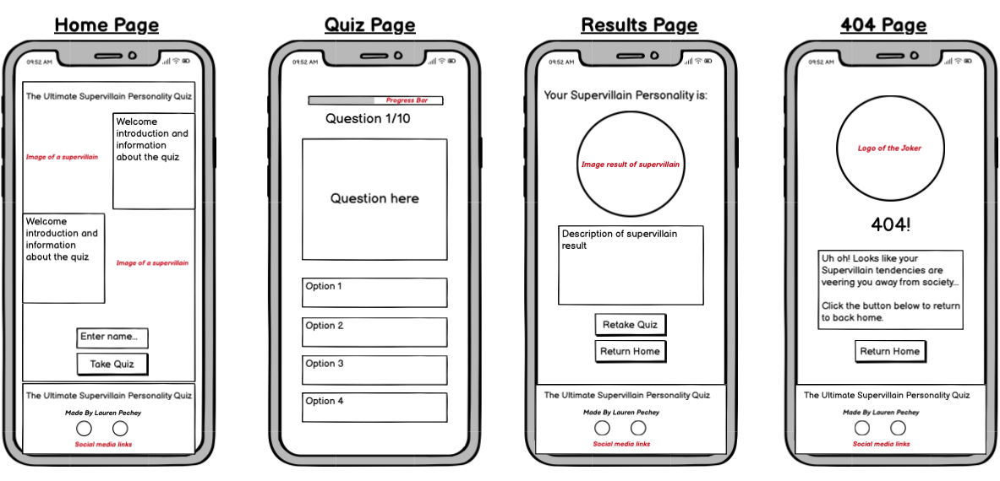
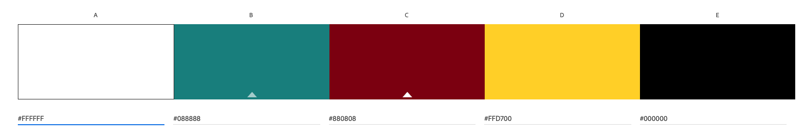
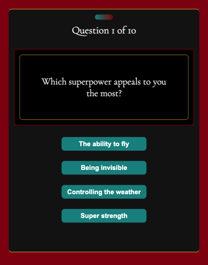
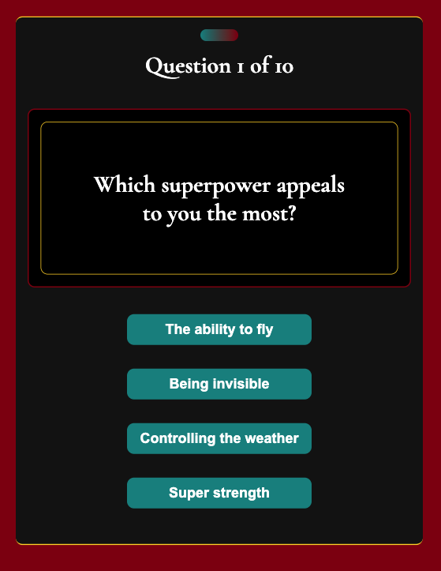
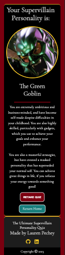
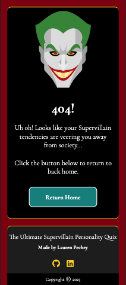
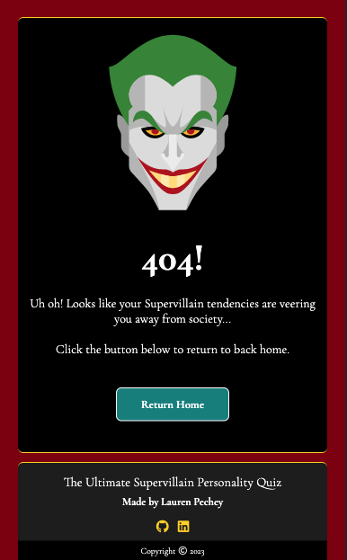
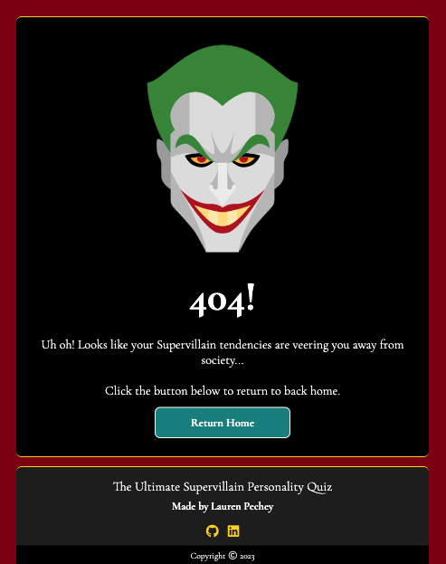

# The Ultimate Supervillain Personality Quiz 

#### By Lauren Pechey
[Click here to view the live web application](https://pecheylauren02.github.io/supervillain-quiz/)

#### HELLO EVERYONE!

This is the documentation for a fun web application: The Ultimate Supervillain Personality Quiz! It has been built using HTML5, CSS3 and JavaScript as an educational Project offered as part of Code Institute’s Diploma in Full Stack Software Development. Disclaimer: This quiz is not backed up by psychological research, and thus the results are designed for entertainment purposes only. Please use the table of contents below to navigate through all of the planning, features, deployment, testing and more!

## Table of Contents

1. [Project Development and Planning](#project-development-and-planning)
    - [Project Goals](#project-goals)
        - [Project Purpose](#project-purpose)
        - [Client Goals](#client-goals)
        - [Target Audience](#target-audience)
        - [User Goals](#user-goals)
    - [Research](#research)
        - [Market Review](#market-review)
        - [Key Takeaways](#key-takeaways-from-market-review)
    - [User Stories](#user-stories)
    - [Content](#content)
    - [Design, Layout and Structure](#design-layout-and-structure)
        - [Wireframes](#wireframes)
        - [Structure and Layout](#structure-and-layout)
        - [Design and Colour](#design-and-colour)
        - [Font](#font)
2. [Technologies Used](#technologies-used)
    - [Languages](#languages)
    - [Tools](#tools)
3. [Features](#features)
    - [Whole Site](#whole-site)
        - [Favicon](#favicon)
        - [Footer](#footer)
    - [Welcome Section](#welcome-section)
    - [Quiz Section](#quiz-section)
        - [Progress Bar](#progress-bar)
        - [Questions and Options](#questions-and-options)
    - [Results Section](#results-section)
        - [Supervillian Personality Reveal](#supervillain-personality-reveal)
        - [Retake Quiz Button](#retake-quiz-button)
        - [Return Home Button](#return-home-button)
    - [Other Pages](#other-pages)
        - [404 page](#404-page)
    - [Future Features](#future-features)
4. [Testing](#testing)
    - [HTML Validator Testing](#html-validator-testing)
    - [CSS Validator Testing](#css-validator-testing)
    - [JS Validator Testing](#js-validator-testing)
    - [Accessibility](#accessibility)
    - [Performance](#performance)
    - [Responsiveness / Device Testing](#responsiveness-/-device-testing)
    - [Browser Compatibility](#browser-compatibility)
    - [Solved Bugs](#solved-bugs)
    - [Testing User Stories](#testing-user-stories)
5. [Deployment](#deployment)
6. [Credits](#credits)

## Project Development and Planning 

### Project Goals 

#### Project Purpose

This web-based quiz was planned and developed using principles of User Experience (UX) design, which include the five planes of Strategy, Scope, Structure, Skeleton, and Surface. Using these principles, the aim was to create a fun, easy-to-use, responsive, and engaging quiz that entertains users who are interested in learning more about their personalities. 

#### Client Goals

The Ultimate Supervillain Personality Quiz website was built as a milestone project for my Diploma in Fullstack Software Development with [Code Institute](https://codeinstitute.net/global/full-stack-software-development-diploma/). It is an interactive quiz designed to entertain users of all ages and backgrounds who want to learn more about the different sides of their personalities, particularly those interested in superheroes and supervillains. Despite this being built for educational reasons, it was treated as a real-world application for clients interested in both learning about their personalities in a fun, engaging way. Thus, this client's goals would be:

- Engaging the users with interactive, fun questions and life choices
- Helping users learn more about their personalities
- Entertaining users by linking their personalities to fictional, quirky supervillain characters
- Ensuring the questions and options are clear, and the quiz is simple to navigate

#### Target Audience

- This quiz is designed for users of any background or age, but will most likely gain more interest from fans of Disney, Marvel, or DC superheroes and supervillains.
- It is also likely to draw in users who are inquisitive about their personality and how they would deal with certain scenarios in life. 
- The simplicity of the website makes it easy for adults, teenagers and even children to take and retake the quiz as many times as they want, and access the results each time. 

#### User Goals 

The quiz aims to ensure that users can:

- Learn more about their personalities and how they would handle certain life scenarios
- Be entertained and engaged while taking a short quiz
- Navigate easily through the questions without interruptions
- See eye-catching results after answering all of the questions
- Retake the quiz as many times as they want to, to explore different results

### Research 

#### Market Review 

Before designing the website, I reviewed other personality quiz websites (see below), in order to get a feel of how they presented themselves, which content and features they offered, and the design choices they made in terms of colour palette. I also reviewed what appeared to work well for the user and what needed improvements. 

[BuzzFeed](https://www.buzzfeed.com/gustorchi/we-can-legit-tell-which-super-villain-you-would-be-9iuf1y91vp) | [16 Personalities](https://www.16personalities.com/) | [Playbuzz](https://www.playbuzz.com/quizzes/personality) | [The Superhero Quiz](https://www.thesuperheroquiz.com/villain/) | [Truity Big Five Personality Test](https://www.truity.com/test/big-five-personality-test)

#### Key Takeaways

- The website should be eye-catching, to make users excited about taking the quiz
- The Website should be clean, simple and easy to navigate
- 10 questions is the ideal number to keep the user engaged and interested
- Many quizzes did not offer a back button to allow the user to change their responses
- Clear, enticing images are displayed in the results section
- Most quizzes had a retake quiz button to allow the user to take the quiz again

### User Stories

In a real-world application, this kind of quiz will mostly likely be used by a visitor once, rather than repeatedly, as it would likely form part of a bigger website e.g. a website about personality types, so all user stories relate to a first-time user.

- take part in an interesting quiz and learn more about my personality
- find out what the quiz is about and what to expect before starting the quiz
- navigate easily through the quiz questions 
- have the option of retaking the quiz if I don't like the result
- learn more about why I was matched with a specific SuperVillain at the end of the quiz
- sign up with my name quickly and easily
- access the quiz on any device

These user stories gave me a clear scope for the website and enabled me to stay on track with the project, preventing issues like scope creep at a later stage after the coding process. 

### Content 

This quiz is made up of 10 questions with 4 answer options to choose from, and is set up as follows:
- It provides the user with thought-provoking questions and scenarios, and the user can only select 1 of the 4 options.
- Each answer option is assigned a value of 1 to 4, and each time the user answers a question, a score will be added until all 10 questions are answered.
- After completing all ten questions, the user will be matched with a supervillain based on their total score.  
- Before starting the quiz, users must sign up with their names. 

Each time the user selects an answer it builds up a picture of what kind of personality they have. These results are then processed to calculate the best supervillain match for them, and I included 8 possible matches (a mix of Disney, Marvel, Harry Potter, Stranger Things, and DC supervillains):
- Lord Voldemort
- Cruella de Vil
- Magneto
- Vecna
- Maleficent
- The Joker
- Thanos
- The Green Goblin

It is worth noting that while this is presented as a personality test, this quiz is built for entertainment purposes only, and is not backed by any specific psychological research.

### Design, Layout and Structure 

#### Wireframes

I used [Balsamiq](https://balsamiq.com/) in the initial design phase, before the coding process. This enabled me to develop the website's structure, skeleton, layout and overall look and style. I created designs for desktop, tablet and mobile to make sure that responsiveness was at the forefront of the application from the beginning.

Screenshots

_Desktop Wireframes_

_iPad Wireframes_

_Phone Wireframes_

#### Structure and Layout

The structure of this website was informed by the scope, principles of interactive design (IXD), as well as the user goals of the quiz. Keeping these important concepts in mind ensured that the website conformed to user's expectations and needs. 

The main site is a simple, single-page website with content displayed and hidden at different points in the game using JavaScript code. There are three main sections within the page which appear and disappear depending on where you are in the game, these are:

- Welcome and Instructions Area: A brief introduction with a name capture input to personalise the user's results, as well as "take quiz" button
- Quiz Area: The main quiz area, with a progress bar, question, question container, and four answer options to choose from 
- Results Area: The results of the quiz, showing the user's personality results breakdown in the form of a supervillain image and information about their personality match. This section also contains a "Retake Quiz" button to take the user back to the start if they want to begin the quiz again.
- Footer Area: Displays my name and details

There is also a 404 page for when a user lands on a non-existent page with a button to link back to index.html to start the quiz again.

#### Design and Colour

This site was designed using a mobile-first approach, because after conducting some research (using sites like [Adobe](https://xd.adobe.com/ideas/process/ui-design/what-is-mobile-first-design/)), it appears that most users use their mobile devices over desktop or iPad screens, especially when partaking in quizzes. 

- The design was influenced by villain-inspired colours like deep and bright shades of red, black, gold and green which contrast well and allow for good legibility. 
- The welcome page has images of supervillains looking at the user through semi-circles, to add to villainous theme. 
- I used the same border-radius for all buttons and options to give maintain consistency throughout the site. 

Colour Palette

_Colour Palette for entire website_

Colour Palette for Progress Bar

_Colour Palette for Progress Bar_

#### Font

My choice of font was [Cormorant Garamond](https://fonts.google.com/specimen/Cormorant+Garamond?query=cor) for all paragraphs and headings. This font choice was imported from [Google Fonts](https://fonts.google.com/) and had a backup font of Serif. I chose this font for my website because the cursive style contributed to the supervillain theme, whilst also providing a professional, legible finish.

## Technologies Used 

This website used a combination of three different Front-End development languages, as well as some web tools for the initial planning. A list of those included in the project can be seen as follows: 

### Languages 
- [HTML5](https://en.wikipedia.org/wiki/HTML5)
- [CSS3](https://en.wikipedia.org/wiki/Cascading_Style_Sheets)
- [JavaScript](https://en.wikipedia.org/wiki/JavaScript)

### Tools 
- [Git](https://git-scm.com/)
    - Git was used for version control via GitPod, by using the terminal to Git and Push to GitHub.
- [GitHub](https://github.com/)
    - GitHub was used to store the project code after being created in GitPod/Git.
- [Gitpod](https://www.gitpod.io/)
    - Gitpod was used to create, edit and preview the project's code.
- [Balsamiq](https://balsamiq.com/)
     - Balsamiq was used to create wireframes during the initial design process.
- [Google Fonts](https://fonts.google.com/)
    - Google Fonts was used to select and import the fonts to the project (Libre Baskerville and Libre Baskerville Bold).
- [Font Awesome](https://fontawesome.com/)
    - Font Awesome was used to add icons to the site to help with UX and to add more character to the project visually.
- [Tiny PNG](https://tinypng.com/)
    - Used to further optimise the images for the site and reduce file size
- [Bulk Image Crop](https://bulkimagecrop.com/)
    - Used to bulk crop bulk
- [Adobe Illustrator](https://www.adobe.com/uk/products/illustrator.html) and [Adobe Color] (https://color.adobe.com/create/color-wheel)
    - These were used to create the colour pallette as well as ideas for the initial design.
- [Favicon.io](https://favicon.io/favicon-converter/)
    - Used to create and add the favicon to the browser tab

## Features

### Whole Site

#### Favicon

I included a Favicon for the site using the female supervillain graphic which had the same colours as the site's design. This helped to build the brand and continue the site design in the user's browser tab.

Screenshots

_Favicon_

#### Footer 

- The footer contains the text "Made By Lauren Pechey" and links to my relevant social media sites so that it can be used as a portfolio project
- The footer social icons have aria labels to improve accessibility
- The footer social icons have a hover effect with a smooth colour transition 
- The footer is responsive on all screen sizes

Screenshots

_Footer on Desktop_

_Footer on iPad_

_Footer on Phone_

_Hover effect on social links_

### Welcome Section

This section contains the following features:

- A brief introduction and information about the quiz, how it works and some persuasion for the user to take it
- The layout is responsive on all devices, with margins widening on larger devices
- The semi-circles with the supervillain images in this section expand to full circles on larger screens
- Name input section:
    - User must enter a name to start game - CHANGE THIS alert with appears if no name entered CHANGE THIS
    - The name is used in the results section to personalise the results
    - The name limits the number of characters to a minimum of 2 and a maximum of 15 to make the text in the results section work visually
- Take Quiz button - launches the quiz
    - Has a hover effect on non-touchscreen devices with a smooth colour transition 

Screenshots

_Welcome section on Desktop_

_Welcome section on iPad_

_Welcome section on Phone_

_Name Input and Take Quiz button_

_Alert div_

### Quiz Section

The quiz section is fully responsive with the answers increasing in font size and expanding in width on larger devices. I used [Adobe Illustrator](https://www.adobe.com/products/illustrator.html) to choose the shade of green for the option buttons. This colour was selected because it was matched as complimentary to the shade of red chosen in the background. 

Screenshots

_Quiz section on Desktop_

_Quiz section on iPad_

_Quiz section on Phone_

#### Progress Bar

- Gives the user an indication of where they are in the quiz and how many questions are left
- Contains both a visual reference in the colour bar and a number reference in the question number
- Updates when a user selects an answer and the question is repopulated

Screenshots

_Progress Bar Design_

#### Questions & Options

- Displays the question and four options, and updates with the next question and a set of options each time the user makes a selection
- Has a different colour hover effect on the answers on non touchscreen devices with a smooth transition
- Once the user has selected an answer it turns ADD COLOUR HERE
- CHANGE THIS FIRST IN CODE There is a brief timeout to allow the orange to appear before the question & answers update, this gives the user a sense that the answer has definitely been selected and submitted and gives them time to see the question update happenning - all part of creating an intuitive and positive user experience.
- A separate 'next question' button was excluded from the options, as it adds an extra click for the user which they may find annoying
- CHANGE THIS FIRST IN CODE During the time out the user cannot select another answer - this avoids accidental selections or duplicate results

Screenshots

_Questions and options section_

_Answer hover effect_

### Results Section

#### Supervillian Personality Reveal

- This section gives detailed information about the user's supervillain personality results
- The title result is personalised to the user with the name that the user input at the start of the quiz
- The total score calculated once the user has answered all 10 questions is calculated and matched with one of eight possible supervillains (see the list above)
- The result includes a picture of the supervillain chosen, as well as information about the personality type associated with that supervillain match
- The supervillain personality results are fully responsive, expanding in size on larger screens

Screenshots

_Results section on Desktop_

_Results section on iPad_

_Results section on Phone_

#### Retake Quiz Button

- This button is displayed below the results section and allows the user to restart the quiz
- It has the same design, colour and hover effect as the Take Quiz button, to maintain consistency throughout the quiz
- It is only displayed in the results section once the user has finished taking the quiz, to prevent the user from accidentally restarting the quiz when they have not completed all of the questions

Screenshots

_Retake Quiz Button_

#### Return Home Button

- This button is displayed below the results section and allows the user to return to the welcome section if they wish so
- It has the same design, colour and hover effect as the Go Home Button on the 404 page, to maintain consistency throughout the quiz

### 404 Page

- The 404 page was set up to smoothly handle user's who have ended up on a non-existent part of the site
- This page provides a positive emotional response to the user and a better user experience
- It has the same design as the rest of the site, so the users don't feel like they have left the site, encouraging them to return to the home page
- The design, colour and text all match the supervillain theme of the quiz in order to maintain consistency
- The go back button takes the user back to the home page so there is no need for the user to use the browser back button

Screenshots

_404 Page on phone, ipad and desktop screens_

## Future Features 

I would like to add additional features to expand the site. This unfortunately fell out of the scope of this project, but would be useful to users in future. 

#### User Log In Account and Sign Up Page

This would give the user the ability to save their results and recommendations, creating a secure account and log in so that they can re-access their data.

#### Additional Personality Quizzes

As was mentioned previously, this quiz is a simple design, but would ideally be part of a larger, more complex quiz website. Therefore, for future features, I would like to add:
- Different types of personality quizzes, so the user can learn about their personality in a variety of different contexts
- Add a navbar that would help the user navigate through the different quizzes
- Add more detailed information, backed by psychological research, about the different personality types in the quiz results sections

## Testing

### Automated Testing

#### HTML Validator Testing 

I ran my HTML code for each page through the [W3C HTML Validator](https://validator.w3.org/). Thankfully, no errors were displayed. There were some minor warnings, due to the use of multiple h1 elements, but once this was resolved, the results came back clean. 

Screenshots

_HTML Validator Warnings_

_HTML Validator Result_

#### CSS Validator Testing

I ran my CSS code through the [W3C CSS Validator](https://jigsaw.w3.org/css-validator/) as well as [(Jigsaw) validator](https://jigsaw.w3.org/css-validator/validator?uri=https%3A%2F%2Fvalidator.w3.org%2Fnu%2F%3Fdoc%3Dhttps%253A%252F%252Fcode-institute-org.github.io%252Flove-maths%252F&profile=css3svg&usermedium=all&warning=1&vextwarning=&lang=en). No errors were displayed, however there was one warning shown regarding the use of vendor extended pseudo elements (see screenshot). This was kept in the file despite the warning, as it was the only way to access the progress bar for styling. 

Screenshots

_CSS Validator Warning_

_CSS Validator Results_

#### JavaScript Validator Testing

I ran my JavaScript code through [Jshint validator](https://jshint.com/). The only warnings shown initially were to use -moz instead of let for global variables. However, once I configured the settings to support "New JavaScript Features (ES6)" there were no warnings, other than a syntax suggestion, which was fixed (see screenshots):

Screenshots

_JS Validator Issues_

_JS Validator Result_

_Change of configuration_

#### Accessibility

I tested accessibility of the website using Google Chrome Dev Tools Lighthouse, and the scores came out clean. I also ran the site through the [Wave Web Accessibility Evaulation Tool](https://wave.webaim.org/). No warnings or errors were shown. 

Screenshots

_Accessibility result on Lighthouse_

_Accessibility result on Wave_

#### Performance & Lighthouse

I tested the site's performance through Google Chrome Dev Tools Lighthouse. Thankfully, the performance, accessibility, SEO and best practices all produced good scores. 

Screenshots

_Performance, accessibility, SEO and best practices result_

### Manual Testing

#### Testing User Stories

I ran manual tests on the website, based on the user stories mentioned above:

| No. | User Goal | How is it achieved? |
| :--- | :--- | :--- |
| 1 | I want to take part in an interesting quiz and learn more about my personality | The quiz is an engaging, online game which gives people an insight into their personality and how they would match with a supervillain. It has been designed to have limited questions to keep the user interested, and creates fun, unusual scenarios for the user to choose from. |
| 2 | I want to find out what the quiz is about and what to expect before starting the quiz | The welcome section contains information about what the quiz is about, and is designed with the supervillain theme in mind so the user knows what to expect from the beginning. |
| 3 | learn more about why I was matched with a specific SuperVillain at the end of the quiz | The personality results are detailed with a picture of the matched supervillain, as well as a clear description of their personality based on their choices. |
| 4 | I want to access the quiz on any device | The quiz has been designed to be fully responsive across desktop, tablet and mobile and extensively tested on each. |
| 5 | I want to navigate easily through the quiz questions | The site has a linear navigation where you follow the quiz through and minimal clicks are required to submit answers. |
| 6 | I want to sign up with my name quickly and easily | The site has a simple name-input section which allows the user the enter their name, and upon submission, the quiz will start immediately. |
| 7 | I want to have the option of retaking the quiz if I don't like the result | The site has a retake quiz button below the results, once the user has completed the quiz, to give them the option of taking the quiz again. |

#### Browser Compatibility

The site was tested on the following browsers, with no browser-specific bugs detected. 

- Google Chrome
- Mozilla Firefox
- Apple Safari

#### Responsiveness/Device Testing

The website was tested on the following devices:
- HP Display 27-inch External Monitor
- Apple Macbook Pro 13-inch
- Galaxy S9+
- Apple iPhone 12 Pro
- Apple iPhone SE
- Apple iPad mini
- Apple iPad
- Galaxy Tablet
- Google Chrome Developer Tools - using responsive testing for all screen sizes

The website functioned as expected on all devices.

### Solved Bugs

#### All results were displayed at once

When the user retakes the quiz, all of the results were displaying at the same time, rather than just one. This was an issue with the displaying results function in the JavaScript code: The "hide" class was not being added to the unwanted results in the function. Once this was added, the results functioned as expected:

Screenshots

_Results bug_

_Results fixed_

#### Retake Quiz button not working

When the user clicked the retake quiz button, the user was taken to question 10 of 10, instead of question 1 of 10. This is because the score and progress bar were not reset to 0, so the questions were not reset to the beginning. To fix this, I reset the score and progress bar to 0.

Screenshots

_Quiz page shown after user clicked the retake quiz button_

_Quiz page shown after bug was fixed_

## Deployment

### GitHub Pages

The site was deployed to GitHub pages. The steps to deploy are as follows: 
1. In the GitHub repository, navigate to the Settings tab 
2. From the left hand menu select 'Pages'
3. From the source select Branch: main
4. Click 'Save'
5. A live link will be displayed when published successfully. 

The live link can be found here: [The Ultimate Supervillain Personality Quiz](https://pecheylauren02.github.io/supervillain-quiz/)

### Forking the GitHub Repository

You can fork the repository by following these steps:
1. Go to the GitHub repository
1. Click on Fork button in upper right hand corner

### Cloning the GitHub Repository

You can clone the repository to use locally by following these steps:
1. Navigate to the GitHub Repository you want to clone
2. Click on the code drop down button
3. Click on HTTPS
4. Copy the repository link to the clipboard
5. Open your IDE of choice (git must be installed for the next steps)
6. Type git clone copied-git-url into the IDE terminal

The project will now be cloned locally for you to use.

## Credits

### Design and Planning

- [Adobe Color](https://color.adobe.com/create/color-wheel) helped in developing the colour palette for the initial design phase of the website

### Code

- [W3C Schools](https://www.w3schools.com/jsref/dom_obj_event.asp) helped in providing a reference to all DOM elements 
- [StackOverflow](https://stackoverflow.com/) helped with offering solutions on how to debug css and javascript code
- [W3C Schools](https://www.w3schools.com/w3css/w3css_progressbar.asp) helped in initial structure and styling of progress bar

### Supervillain Images

- [Lord Voldemort](https://www.wallpaperbetter.com/en/hd-wallpaper-weflb/download/1920x1080)
- [Magneto](https://learn.codeinstitute.net/dashboard)
- [The Joker](https://www.wallpaperbetter.com/en/hd-wallpaper-shryv/download/1366x768)
- [Joker Logo](https://icons8.com/icons/set/joker)
- [The Green Goblin](https://www.wallpaperbetter.com/en/hd-wallpaper-peptw/download/1366x768)
- [Thanos](https://www.wallpaperbetter.com/en/hd-wallpaper-sormx)
- [Vecna](https://www.nawpic.com/vecna-10/)
- [Maleficent](https://www.wallpaperbetter.com/en/hd-wallpaper-swlee/download/1366x768)
- [Maleficent on Welcome page](https://www.wallpaperbetter.com/en/hd-wallpaper-cwcsi)
- [Cruella](https://www.wallpaperbetter.com/en/hd-wallpaper-wfnbu/download/1366x768)

### Acknowledgements

- My mentor, Rohit Sharma, for all of his help and advice throughout the project
- The whole team at [Code Institute](https://codeinstitute.net/) for their teaching and support